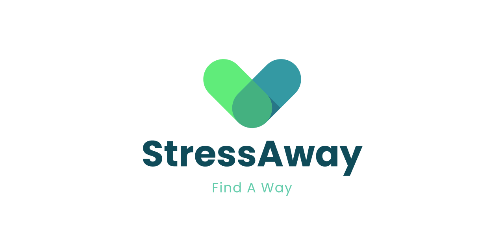

# Welcome To StressAway

----
### What is StressAway🏥?

StressAway is a product that enhances the mood of a person by recommending stress relief ways based on the journal written by the person. The product analyzes the journal📒, understands the mood of a person and recommends music🎶 , movies🎬, books📚, exercises🏋️, diet🥗 and also the places around the user’s location 📍 that boosts his/her mood.

### Our Aim🦋

#### ***To help all students maintain Good Mental Health.*** 👨‍🎓👩‍🎓


[**Website link**](https://stress-away-web-app.vercel.app/) 👨‍💻

[**Mobile Application link (Android)**](https://drive.google.com/drive/folders/13kcI2Q12l0TTOh-hZVT12UmhoosnpiUQ?usp=share_link) 👩‍💻

----
### Setup the website😉

>GitHub

- 1️⃣ fork the repository📗 and give it a star🌟
- 2️⃣ pull down the repository which you have forked.
- 3️⃣ in the same directory install run🏃 the following commands.

>Directory

Make sure that Node.js is previously installed in your system, than run the below command

```console
npm install -g npm
```


Next run the below command install the latest firebase💥

```console
npm install firebase
```


Than run the below command and the website will be locally hosted ✅

```console
npm run dev
```

If in case it dosen't run and pops up that firebase is not installed, just restart the system and it will be ready to go on your local server.

----
### About Us💚

Covid 19 pandemic has a severe impact on global mental health leading to a significant increase in anxiety and depression cases. This is a serious issue because it affects an individual’s daily life and relationships but also has long-term consequences for their physical health and well-being.  
  
Mental health is a critical aspect of overall health and well-being and it is essential to address this issue in order to support individuals and communities in order to overcome the challenges posed by the pandemic.  
  
StressAway can be can be a valuable tool to address given health⚕ problem issues related to stress and anxiety. Stress is a common issue that affects many people in today's fast-paced and demanding world. It can lead to a range of mental health problems, including anxiety, depression, and insomnia, among others.   
  
StressAway is designed to help individuals manage and reduce their stress levels by promoting relaxation and mindfulness. This product can help to create a calming and relaxing atmosphere that reduces stress and promotes relaxation. This can be particularly important for individuals who feel overwhelmed or out of control in their daily lives.

----
### Credits💫

>GitHub [@RionDsilvaCS](https://github.com/RionDsilvaCS)  ·  Linkedin [@Rion Dsilva](https://www.linkedin.com/in/rion-dsilva-043464229/)
Android Developer📱

>GitHub [@puneethx](https://github.com/puneethx)  ·  Linkedin [@Puneeth Reddy](https://www.linkedin.com/in/puneeth-reddy-75069824b/)
Web Developer🌐

>GitHub [@Aniesh04](https://github.com/Aniesh04)  ·  Linkedin [@Aniesh Reddy Gundam](https://www.linkedin.com/in/aniesh-reddy-gundam-016365232/)
Web Developer🌐

---
© 2023 StressAway💚
